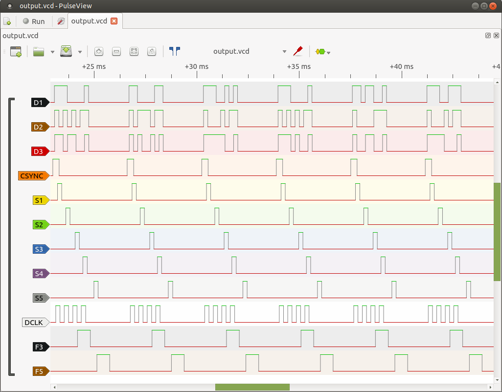

**PLEASE NOTE: THIS CODE HAS NOT BEEN TESTED AND MAY NOT WORKING PROPERLY**

# PrintSpider for Arduino

This repository contains source code for the [PrintSpider project](https://hackaday.io/project/176931-hp-printer-cartridge-control-module) of HP printer cartridge control module for Arduino Uno board. Project is about creating an Arduino compatible control module for HP cartridge in easy to connect format, witch parts almost all is printable with 3D printer.

## Project stucture

Source code organised as [PlatformIO](https://platformio.org/) project, so you can read full documentation about it in it's [documentation](https://docs.platformio.org/en/latest/).
Most important parts consists of:

- **./main.c**: source code of the simple program for jetting with cartridge.
- **./lib/PrintSpider/printspider.h** and **./lib/PrintSpider/printspider.h**: header and implementation of the library of generator of output signals sequences for control module.

## Development

To debug this code locally without real Arduino board you could clone this project with command:

```bash
git clone https://github.com/lichnost/PrintSpider_Arduino.git
```

Open project with PlatformIO.
Then you can run it with PlatformIO [debug](https://docs.platformio.org/en/latest/plus/debugging.html) feature. **./platformio.ini** has configured property to debug builded firmware with [simavr](https://github.com/buserror/simavr) AVR simulator.

Additionally you can run simulation with otputing logic data to VCD(value change dump) file for viewing in logic analisys GUI like [GTKWave](http://gtkwave.sourceforge.net/) or [PulseView](https://sigrok.org/wiki/PulseView).
Before that, you will need to build and install latest version of *simvar* from source code as follows:

```bash
git clone https://github.com/buserror/simavr.git
cd simavr/
make install RELEASE=1
```

Then you can build project and start simulation with command:

```bash
simavr ./.pio/build/uno/firmware.elf -m atmega328p -f 16000000L --output output.vcd --add-trace D1=trace@0x002B/0x01 --add-trace D2=trace@0x002B/0x02 --add-trace D3=trace@0x002B/0x04 --add-trace CSYNC=trace@0x002B/0x08 --add-trace S1=trace@0x002B/0x10 --add-trace S2=trace@0x002B/0x20 --add-trace S3=trace@0x002B/0x40 --add-trace S4=trace@0x002B/0x80 --add-trace S5=trace@0x0025/0x01 --add-trace DCLK=trace@0x0025/0x02 --add-trace F3=trace@0x0025/0x04 --add-trace F5=trace@0x0025/0x08
```

Output VCD file will be named **./output.vcd**.

Screenshot from PulseView:


## Licensing

Originally code in **./lib/PrintSpider/printspider.h** and **./lib/PrintSpider/printspider.c** borrowed from here [https://github.com/Spritetm/printercart_simple](https://github.com/Spritetm/printercart_simple) was licensed under "THE BEER-WARE LICENSE" (Revision 42). In this repository it's license is changed with Apache License, Version 2.0.

All code provided here licensed with Apache License, Version 2.0.

```
Copyright 2021 Pavel Semenov

Licensed under the Apache License, Version 2.0 (the "License");
you may not use this file except in compliance with the License.
You may obtain a copy of the License at

    http://www.apache.org/licenses/LICENSE-2.0

Unless required by applicable law or agreed to in writing, software
distributed under the License is distributed on an "AS IS" BASIS,
WITHOUT WARRANTIES OR CONDITIONS OF ANY KIND, either express or implied.
See the License for the specific language governing permissions and
limitations under the License.
```
